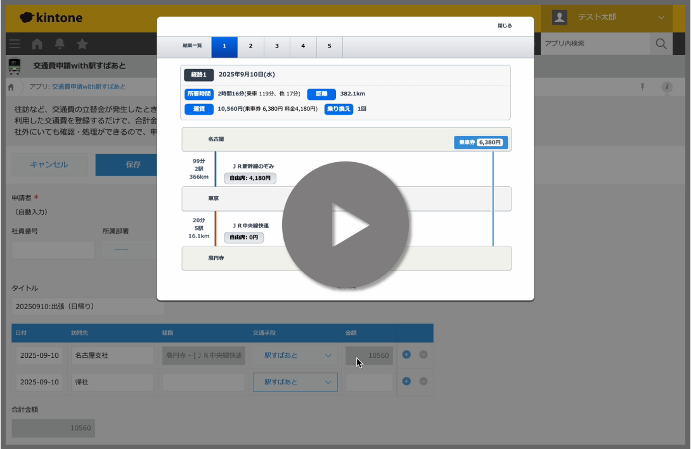

# 「駅すぱあと API」 HTML5インターフェースkintone連携サンプルプログラム

「駅すぱあと API」の[HTML5インターフェースサンプル](https://github.com/EkispertWebService/GUI)とkintoneアプリを連携するサンプルプログラムです。

kintoneアプリに「駅すぱあと API」のGUIパーツを利用し、駅検索、経路検索、経路の料金取得といった**交通費申請に必要な機能を組み込むことができます。**

[](assets/demo.mp4)
💡上の画像をクリックすると、動画（約30秒）が別タブで開きます

このサンプルコードは以下のようにご利用いただけます。
✅無償で利用可能
✅利用に関する承諾不要
✅改変自由

以下の場合は、ご利用をお断りします。
❌ソースコード自体の販売
❌反社会的勢力や違法行為に関わる利用

# ご利用方法
1. [利用条件](https://github.com/EkispertWebService/ekispert-api-kintone-sample/blob/main/LICENSE.md)をご確認ください
2. [本リポジトリ](https://github.com/EkispertWebService/ekispert-api-kintone-sample?tab=readme-ov-file)から、サンプルコードを全てダウンロードしてください
    * kintoneと連携するために必要なソースコードです
3. [「駅すぱあと API」 HTML5インターフェース リポジトリ](https://github.com/EkispertWebService/GUI)から、サンプルコードを全てダウンロードしてください
    * kintone上でアプリケーションを動かすために必要なソースコードです
4. [「駅すぱあと API スタンダードプラン」評価版をお申し込み](https://api-info.ekispert.com/form/trial/)ください
    * APIを利用するために必要なアクセスキーが発行されます
    * 評価版は**90日間無料**でお使いいただけます
5. アクセスキーが届いたら、次の[「kintoneとの連携方法」](#kintoneとの連携方法)を参考にご利用を開始してください

# kintoneとの連携方法
## 1. サンプルアプリの追加
* 以下のサイトを参考に「交通費申請」サンプルアプリをkintone上に作成します。
    * [サンプルアプリを追加する | kintone ヘルプ](https://jp.cybozu.help/k/ja/user/create_app/add_app_store.html)
    * 「交通費申請」サンプルアプリ: [交通費申請 - kintone（キントーン）- すぐに使えるサンプルアプリ | サイボウズの業務改善プラットフォーム](https://kintone-sol.cybozu.co.jp/apps/027-kotsuhi.html)
## 2. 駅すぱあと APIのアクセスキーの設定
* 「本リポジトリ」の「ekispert-api-kintone-sample.js」の以下の部分にアクセスキーを設定
```ekispert-api-kintone-sample.js
        // 駅すぱあとWebサービスのアクセスキー
        var ekispertAccessKey = 'アクセスキーを指定してください';
```
## 3. サンプルアプリの変更
※ kintoneの操作については以下を参照

 [フォームを設定する | kintone ヘルプ](https://jp.cybozu.help/k/ja/app/form/design/set_form.html)

 [JavaScriptやCSSでアプリをカスタマイズする | kintone ヘルプ](https://jp.cybozu.help/k/ja/app/customize/js_customize.html)

1. 「フォーム」の変更
    * 「タイトル」の横に「スペース」を追加
        * 「要素ID」に「course-result-space」を設定
    * テーブルに「交通手段」の「ドロップテーブル」の設定を変更
        * 「項目と順番」に「駅すぱあと」を作成
        * 「フィールドコード」に「交通手段」を設定
    * テーブルの「訪問先」の列の横に「文字列（1行）」の列を追加
        * 「フィールド名」に「経路」を設定
        * 「フィールドコード」に「経路」を設定
2. 「設定」> 「JavaScript / CSSでカスタマイズ」の変更
    * PC用のJavaScript / CSSファイルのJavaScriptファイルの「URL指定で追加」で、以下のURLを追加
        * https://js.cybozu.com/jquery/3.7.1/jquery.min.js
        * https://js.cybozu.com/sweetalert2/v7.3.5/sweetalert2.min.js
    * PC用のJavaScript / CSSファイルのJavaScriptファイルの「アップロードして追加」で、以下のファイルを追加
        * 「駅すぱあと API HTML5インターフェース」の「expGuiCourse.js」、「expGuiStation.js」、「expGuiCondition.js」
        * 「本リポジトリ」の「ekispert-api-kintone-sample.js」
    * PC用のJavaScript / CSSファイルのCSSファイルの「URL指定で追加」で、以下のURLを追加
        * https://js.cybozu.com/sweetalert2/v7.3.5/sweetalert2.min.css
    * PC用のJavaScript / CSSファイルのCSSファイルの「アップロードして追加」で、以下のファイルを追加
        * 「駅すぱあと API HTML5インターフェース」の「expGuiCourse.css」、「expGuiStation.css」、「expGuiCondition.css」
        * 「本リポジトリ」の「ekispert-api-kintone-sample.css」
3. アプリの更新を実行
4. レコードを新規作成し、「交通手段」から「駅すぱあと」を選択し、駅入力画面が表示されることを確認

# 注意事項
* kintone上で「駅すぱあと API」を利用するためには、kintoneのアカウントが必要です
* 本ソースコードは、サンプルとしてのご提供のため、動作保証やお問い合わせ等のサポートは承っておりません
* アクセスキーの発行はドメイン毎です。別用途で使っているキーの転用はできません。
    * すでにアクセスキーをお持ちの方は、改めてkintone用として利用するためのアクセスキーの発行が必要です
